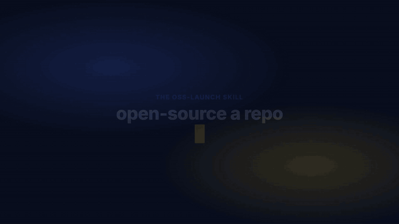

# oss-launch

[](LICENSE)
[](https://docs.claude.com/en/docs/claude-code)
[](CHANGELOG.md)
[](https://github.com/AnayDhawan/oss-launch/stargazers)


**Take a repo open source the right way.** Run `/oss-launch` and it scans your repo, asks
only what it cannot infer, then generates a tailored open-source file collection: README,
LICENSE, CONTRIBUTING, CODE_OF_CONDUCT, SECURITY, CHANGELOG, `.gitignore`, GitHub issue and
PR templates, and CI. Then it helps you launch: badges, metadata, releases, demo GIFs, and
a Show HN / Reddit / YouTube playbook.



*A stylized motion-graphics demo of the workflow, not an actual recorded run. For a real
run's actual output, see [`example/`](example/) — a real before/after scaffold with real
`audit.sh` scores (1/16 -> 16/16), not hand-written boilerplate.*

If this is useful, star it. It helps other solo maintainers find it.

## Why

Most solo projects never get the boring-but-decisive OSS files: a real LICENSE, a
contributing guide, a security policy, a README that pitches in one line. `oss-launch` does
the scan and the scaffolding in one pass, adapted to your stack and repo, instead of
pasting boilerplate that still says `{{REPO}}`.

## Quick start

This is a skill for agent harnesses. For Claude Code, install it where the harness discovers skills:

```bash
git clone https://github.com/AnayDhawan/oss-launch.git ~/.claude/skills/oss-launch
```

Then, inside any repository you want to open source:

```
/oss-launch
```

It will scan, report gaps, ask a few questions, and generate the files. The shell helpers
also run standalone:

```bash
bash ~/.claude/skills/oss-launch/scripts/audit.sh .      # gap checklist for the current repo
```

### No agent? Run it headless

`scripts/apply.sh` runs the same scan -> generate -> re-audit flow from a config file
instead of an agent Q&A round, so it works in plain CI or a terminal with no agent loop:

```bash
cp templates/oss-launch.config.example oss-launch.config   # fill in AUTHOR, SECURITY_EMAIL, TAGLINE
bash scripts/apply.sh /path/to/your/repo --config oss-launch.config
```

It never overwrites an existing file, and skips README.md generation (prose is an agent-only
step) rather than emitting boilerplate — see `AGENTS.md` for per-harness agent setup instead.

## What it does

```
/oss-launch
  0. Scan      stack, existing files, git remote, secrets/brand leaks
  1. Report    gap table (scripts/audit.sh)
  2. Ask       license, author, security contact, type, tagline (only what is unknown)
  3. Generate  the OSS file collection from templates/, adapted and placeholder-filled
  4. Re-audit  what was created/updated, what is still manual
  5. Launch    metadata, CI, releases, demo GIF, Show HN / Reddit / YouTube (on demand)
```

## What is in here

| Path | What |
|------|------|
| `SKILL.md` | The skill: the scan to generate workflow Claude follows |
| `AGENTS.md` | Install + invocation for non-Claude harnesses (Cursor, Aider, Codex CLI, etc.) |
| `references/` | The detail: scan, generate, README anatomy, metadata, CI/CD, release, launch, media |
| `templates/` | The payload written into your repo: LICENSE, README, CONTRIBUTING, CoC, SECURITY, CHANGELOG, `.gitignore` variants, `.github/` templates, CI workflows |
| `scripts/` | `audit.sh`, `apply.sh` (headless mode), `release.sh`, `setup-labels.sh`, `generate-media.sh`, `update-readme-with-gif.sh` |
| `launch/` | Ready-to-edit Show HN, Reddit, and YouTube post templates + screenshot storyboard |
| `setup/` | One-time media (Playwright + ffmpeg) setup notes |
| `example/` | A real generated run: a bare fixture repo before/after, with the actual `audit.sh` scores (1/16 -> 16/16) |

`templates/` is the payload emitted into other repos. The root files (this README, LICENSE,
and so on) describe oss-launch itself.

## Contributing & security

Contributions are mostly new/updated templates and script fixes - see
[CONTRIBUTING.md](CONTRIBUTING.md) and the [Code of Conduct](CODE_OF_CONDUCT.md). Found a
vulnerability? Report it privately per [SECURITY.md](SECURITY.md), not as a public issue.
Roadmap lives in the [open issues](https://github.com/AnayDhawan/oss-launch/issues).

## License

Apache-2.0. See [LICENSE](LICENSE). Files this skill generates into your repo are yours; pick
their license (Apache-2.0 or MIT) when prompted.
